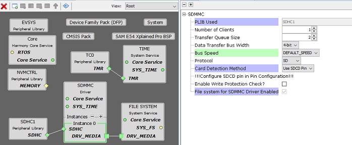
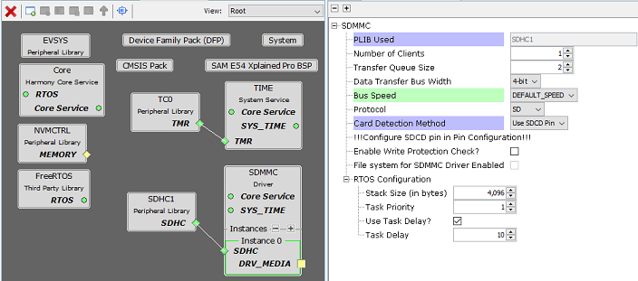
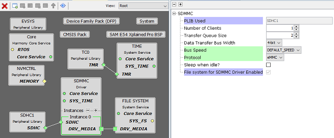

# Configuring The Library

SDMMC Driver Library should be configured via MHC. The following figures show the MHC configuration window for SDMMC driver and brief description.

**Common User Configuration for all Instances**

-   **Driver Mode:**

    -   Allows User to select the mode of driver\(Asynchronous or Synchronous\). This setting is common for all the instances.

    -   Only Asycnhronous mode is supported for now

**Instance Specific User Configurations**

**Asynchronous Mode with SD protocol and File-System**

**Asynchronous Mode with SD protocol, RTOS and without File-System**

**Asynchronous Mode with eMMC protocol and File-System**

-   **PLIB Used:**

    -   Specifies the peripheral library used by the SDMMC driver. This can either be the HSMCI PLIB or the SDHC PLIB.

-   **Number of Clients:**

    -   Specifies number of clients that can access the specific instance of the driver

-   **Transfer Queue Size:**

    -   Specifies maximum number of requests that can be queued

    -   This Configuration is displayed only in **Asynchronous mode**

-   **Data Transfer Bus Width:**

    -   Specifies the Bus width to be used for data transfer \(1-Bit, 4-Bit\)

-   **Bus Speed:**

    -   Specifies Bus Speed to be used for Communication with SD-card \(DEFAULT\_SPEED, HIGH\_SPEED\)

    -   Standard SD-Cards only support Default Speed

    -   SD-Cards with High Capacity support Both Default and High Speed

-   **Protocol:**

    -   Specifies whether SD or eMMC protocol is enabled in the SDMMC driver.

-   **Sleep when idle?**

    -   This option is available only when eMMC protocol is enabled.

    -   Enabling this option puts the eMMC card in sleep mode when no data transfers are pending. When a data transfer is requested, the SDMMC driver brings the eMMC card out of sleep mode. Refer to the eMMC datasheet for the switching time from standby to sleep and vice-versa.

-   **Card Detection Method:**

    -   Specifies the card detection method used by the SDMMC driver. Either SDCD pin or Polling method can be used to detect insertion/removal of SD Card

-   **Polling Interval \(ms\):**

    -   If the Card Detection Method is selected as "Use Polling", then this option specifies the rate at which the SDMMC driver checks for SD Card insertion/removal

-   **File system for SDMMC Driver Enabled:**

    -   Indicates whether SDMMC driver will register its services with the file system or not.

    -   This option is automatically checked when the file system is connected to the SDMMC driver.

-   **RTOS Settings:**

    -   This configuration is displayed only in asynchronous mode

    -   **Stack Size \(in bytes\):**

        -   Specifies the number of bytes to be allocated on the stack for the SDMMC driver task of the instance

    -   **Task Priority:**

        -   Specifies priority for the SDMMC driver task thread. The value can vary based on RTOS used

    -   **Use Task Delay?**

        -   When enabled the SDMMC driver task will be scheduled out voluntarily after every run based on the delay configured.

        -   **Task Delay:**

            -   Specifies the duration the task has to go to sleep after every run.

            -   Should be configured carefully based on the application need and number of task running along in the system

**RTOS Settings For MicriumOS-III RTOS**

Below additional options are visible in **drivers instance RTOS settings** when the MicriumOS-III is added into project graph

-   **Maximum Message Queue Size:**

    -   This argument specifies the maximum number of messages that the task can receive through internal message queue.

        -   A MicriumOS-III task contains an optional internal message queue \(if OS\_CFG\_TASK\_Q\_EN is set to DEF\_ENABLED in os\_cfg.h\).

    -   The user may specify that the task is unable to receive messages by setting this argument to 0

-   **Task Time Quanta:**

    -   The amount of time \(in clock ticks\) for the time quanta when Round Robin is enabled.

    -   If you specify 0, then the default time quanta will be used which is the tick rate divided by 10.

-   **Task Specific Options:**

    -   Contains task-specific options. Each option consists of one bit. The option is selected when the bit is set.

    -   The current version of MicriumOS-III supports the following options:

        -   **Stack checking is allowed for the task:**

            -   Specifies whether stack checking is allowed for the task

        -   **Stack needs to be cleared:**

            -   Specifies whether the stack needs to be cleared

        -   **Floating-point registers needs to be saved:**

            -   Specifies whether floating-point registers are saved.

            -   This option is only valid if the processor has floating-point hardware and the processor-specific code saves the floating-point registers

        -   **TLS \(Thread Local Storage\) support needed for the task:**

            -   If the caller doesn�t want or need TLS \(Thread Local Storage\) support for the task being created.

            -   If you do not include this option, TLS will be supported by default. TLS support was added in V3.03.00

**Parent topic:**[SDMMC Driver](GUID-013A85E2-6948-44FA-907E-7DC945B5CE82.md)

