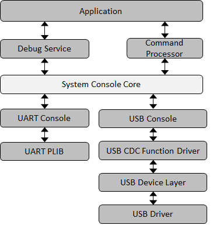

# How the Library Works

Each supported console device has its own implementation of the Console System service APIs. Function pointers to the console device implementations are provided in the console device descriptor registered to each console instance. This allows the user to utilize the same API for all console devices, making application code more portable across different devices.

**Note:** Currently UART and USB CDC Console Devices are supported.

**Abstraction Model**

The Console System Service consists of a core\_layer and a console device\_layer.

The core\_layer handles module initialization and system functions. It provides a common API for use by applications and middleware libraries to send and receive data to and from one or more console devices. The Console System core layer\_maintains the status and device descriptor information for each console instance that has been initialized.

The console device layer\_contains the functional implementation of the core layer\_APIs. Each console device may have a different implementation, but the behavior of the API should be uniform across different devices. The console device layer\_interacts with the peripheral libraries or drivers or middle-wares to send and receive data to and from the hardware peripheral. The details of the data transaction are abstracted by the console device layer.

**Working Flow**

**Read**

The console device layer saves the received data in an internal receive ring buffer. The size of the receive buffer is user configurable.

When the application submits a read request, the console device layer copies the available data from the receive buffer to the application buffer and returns the number of bytes copied. The application must check the return value to verify the number of bytes copied. If the return value is less than the one requested, the application should retry again after some time.

Additional APIs let application query the number of bytes available in the receive buffer and the free space in the receive buffer. It is the application's responsibility to ensure it reads the data out from the receive buffer at regular intervals to avoid receive buffer overflow and hence loss of data.

**Write**

For the write requests, the console device layer copies the application data into the transmit ring buffer. The size of the transmit buffer is user configurable.

The number of bytes actually copied in the transmit buffer is indicated by the return value of the write API. Depending on the free space available in the transmit buffer; the application data may be completely or partially copied. It is the application's responsibility to check the return value. If the return value is less than the one requested, the application should retry sending the remaining characters after some time.

Additional APIs, let application query the free space available in the transmit buffer. APIs are provided to query the number of bytes pending transmission and the configured size of the transmit buffer.

**State Machine**

For UART the read and write state machines are run from the interrupt context in both bare-metal and RTOS environment.

For USB CDC console, the read and write state machine is run from a while\(1\) loop along with other tasks. In RTOS environment, a separate RTOS thread runs the USB CDC console state machine.

**Parent topic:**[Console System Service](GUID-C8EFF72A-1BBB-416E-BF89-EEA2B23EB27D.md)

