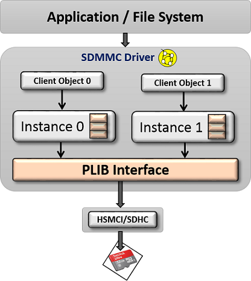

# How the Library Works

The SDMMC driver library is a multi-client, multi-instance buffer queue model based block driver interface.

**Abstraction Model**

The SDMMC driver provides abstraction to communicate with SD/eMMC card through the HSMCI or SDHC peripheral library interface.

**SDMMC Driver Features:**

-   Driver has a buffer queue which allows the capability of accepting multiple requests

-   Driver can either have File-system as client or Application or USB as client

-   Every transfer request expects data in blocks. Block details \(Size and number of blocks\) can be retrieved by DRV\_SDMMC\_GeometryGet\(\)

-   Driver provides feature to register call back for transfer complete event, which can used by clients to get notified

-   Works in both Bare-Metal and RTOS environment in Asynchronous mode

    -   **Bare-Metal:**

        -   A dedicated task routine DRV\_SDMMC\_Tasks\(\) is called from SYS\_Tasks\(\) to process the data from the instance queue

    -   **RTOS:**

        -   A dedicated thread is created for task routine DRV\_SDMMC\_Tasks\(\) to process the data from the instance queue

-   API's return with a valid handle which can be used to check whether transfer request is accepted or not

-   A Client specific handler will be called to indicate the status of transfer

**Parent topic:**[SDMMC Driver](GUID-013A85E2-6948-44FA-907E-7DC945B5CE82.md)

