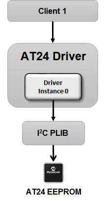

# How the Library Works

The AT24 driver library is a single-client, single-instance based driver interface.

**Abstraction Model**

The AT24 driver interface provides read and write functions that abstract out the internal workings of the AT24 driver and the underlying SPI protocol.

The client can be:

-   Application - Directly access the AT24 EEPROM using the APIs provided by the AT24 Driver library

-   Memory Driver - Application can run a file system on the AT24 EEPROM by connecting it to the Memory Driver which can further be connected to the File System Service

**Working flow**

-   The AT24 Driver Library registers an event handler with the underlying SPI peripheral library \(PLIB\). This event handler is called by the PLIB from the interrupt context to notify the AT24 driver that the requested transfer is complete

-   The library's state machine is driven from the interrupt context. Once a transfer is complete a callback \(if registered by the application\) is given to the application from the interrupt context

-   The library does not support queuing of more than one requests. The application must check and ensure that any previous request is completed before submitting a new one. This can be done either by polling the status of the data transfer or by registering a callback

**Parent topic:**[AT24 Driver](GUID-BA1691E2-6B02-4CCD-94F8-7936A71EC069.md)

