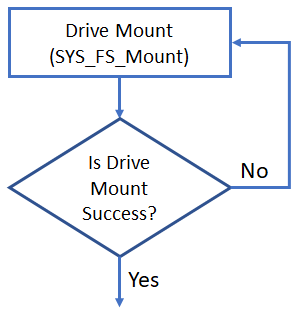
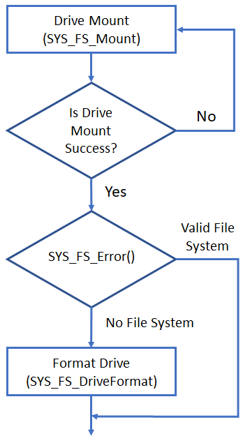

# Using The Library

The File System Service \(SYS\_FS\) provides an application programming interface \(API\) through which a utility or user program requests services of a file system. Refer to the Library Interface section or the generated **sys\_fs.h** file for all the supported API's.

**Application Flow**

-   The application must first mount the media drive for the FS Framework to access the media. Unless the mounting process returns successfully, the application should continue trying to mount the drive. If the drive is not attached, the mounting process will fail. In such a situation, the application should not proceed further unless the mounting is success.

    -   **Mounting a Formatted Drive**

    

    -   **Mounting a Un-Formatted Drive**

        -   If the Drive to be mounted is Un-formatted \(No File system\) then the application needs to format the drive using **SYS\_FS\_DriveFormat\(\)** once the **SYS\_FS\_Mount\(\)** returns success. The application can make use of **SYS\_FS\_Error\(\)** API to check if the mount was successful with no file system on the drive.

    

-   Once the drive is mounted, the application code can then open the file from the drive with different attributes \(such as read/write/append\).

    -   If the file open returns a valid handle, the application can proceed further. Otherwise, the application can keep trying to open the file.

    -   The reason for an invalid handle could be that the application was trying to open a file in read mode from the drive that does not exist. Another reason for an invalid handle is when the application tries to open a file in write mode but the drive is write-protected.

-   Once the file is opened, the valid file handle is further used to read/write data to the file. Once the required operation is performed on the file, the file can then be closed by the application by passing the file handle.


**Example Application to create and write to a file on SD Card**

```c
SYS_FS_HANDLE fileHandle;

APP_STATES state;

void APP_Initialize ( void )
{
    /* Initialize the app state to wait for media attach. */
    state = APP_MOUNT_DISK;
}

void App_Task(void)
{
    switch(state)
    {
        case APP_MOUNT_DISK:
        {
            if (SYS_FS_Mount ("/dev/mmcblka1", "/mnt/mydrive", FAT, 0, NULL) == SYS_FS_RES_SUCCESS)
            {
                state = APP_FILE_OPEN;
            }

            break;
        }

        case APP_FILE_OPEN:
        {
            /* Will open a file in write mode. It creates the file if it does not exist */
            fileHandle = SYS_FS_FileOpen("/mnt/mydrive/file.txt", SYS_FS_FILE_OPEN_WRITE);

            if (fileHandle != SYS_FS_HANDLE_INVALID)
            {
                state = APP_FILE_WRITE;
            }

            break;
        }

        case APP_FILE_WRITE:
        {
            if (SYS_FS_FileWrite(fileHandle, "HELLO WORLD", sizeof("HELLO WORLD")) == -1)
            {
                /* Write Failed Error Out */
                state = APP_FILE_ERROR;
            }
            else
            {
                state = APP_FILE_CLOSE;
            }

            break;
        }

        case APP_FILE_CLOSE:
        {
            SYS_FS_FileClose(fileHandle);

            state = APP_FILE_UNMOUNT;

            break;
        }

        case APP_FILE_UNMOUNT:
        {
             SYS_FS_UnMount("/mnt/mydrive");

             state = APP_IDLE;

             break
        }

        case APP_IDLE:
        {
            break;
        }

        case APP_ERROR:
        {
            /* The application comes here when the demo has failed. Close the opened file */
            SYS_FS_FileClose (fileHandle);

            break;
        }

        default:
        {
            break;
        }
    }
}

```

**Parent topic:**[File System Service](GUID-066D09D2-5550-49D9-ADA2-60A702DB243E.md)

