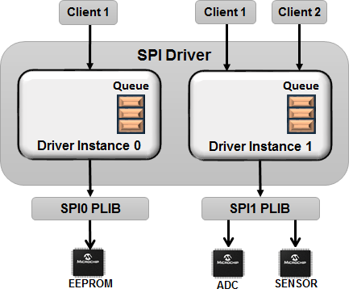

# How the Library Works

The SPI driver library is a multi-client, multi-instance buffer queue model based driver interface.

**Abstraction Model**

The SPI driver provides interface to use multiple SPI Peripherals \(via SPI PLIB instances\) connected with one or multiple slave devices.

-   **Note:** Queue is not present in Synchronous mode of the driver.

**Working Flow**

-   The SPI driver is built on top of the SPI peripheral library

-   The SPI driver is capable of supporting multiple instances of the SPI peripheral

-   The SPI driver supports multiple clients to a driver instance. This is used when there are more than one SPI slaves on the same bus. The driver configures the SPI communication parameters such as SPI clock speed, SPI clock phase and polarity, Data width and chip select automatically based on the SPI slave being talked to you \(that is, based on which client submitted the request\).

-   The SPI driver can be configured to use DMA for data Transfer/Receive.

SPI driver is capable of working in both Asynchronous and Synchronous modes.

**SPI driver in Asynchronous mode**

Asynchronous mode APIs are non-blocking in nature. These APIs submit a request and return back to the application.

Typically, if there are no on-going or pending requests in the driver's transfer queue, then the transfer is started by the API and completed from the peripheral interrupt. If there is an on-going transfer or one or more requests pending in the driver's transfer queue, then the request is added to the queue and executed when all the pending requests are complete. The size of the transfer queue is configurable using MCC based on application needs.

The transfer APIs provide a transfer handle back to the application. If the driver was unable to accept the request, then the transfer handle will be set to NULL. This usually happens if the transfer queue is full or if invalid argruments are passed to the API. Application must check the value of the transfer handle to ensure the request was accepted successfully. Transfer handle can be used to identify/track the request.

Application can either register a callback to get notified when the transfer is complete or poll the status of the request by calling the DRV\_SPI\_TransferStatusGet\(\) API. Asynchronous mode APIs are available in both bare-metal and RTOS mode.

**SPI driver in Synchronous mode**

Synchronous mode APIs are blocking in nature. These APIs block until the transfer/request is complete. Synchronous mode APIs are only supported in RTOS mode. These APIs initate the transfer and then block on a semaphore while the transfer is in progress, thereby allowing other ready tasks to run. Once the transfer is complete, the semaphore is given \(from the peripheral interrupt's context\) thereby unblocking the calling task. The return value usually provides the status of the transfer.

**Parent topic:**[SPI Driver](GUID-B2925496-394D-47ED-BD1E-1AB2149934FA.md)

