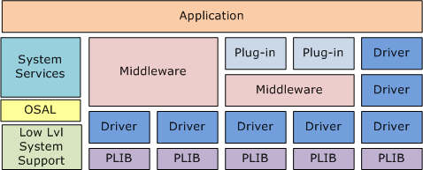

# OSAL Library

The Operating System Abstraction Layer \(OSAL\) provides a consistent interface to allow MPLAB Harmony-compliant libraries to take advantage of Operating System constructs when running in an OS environment or when operating without one. It is designed to take care of the underlying differences between the available OS Kernels or when no kernel is present.

The OSAL provides the interface to commonly available Real-Time Operating Systems \(RTOS\) such that MPLAB Harmony libraries may be written using a single interface to a minimal set of OS features needed to provide thread safety. The OSAL interface can be implemented appropriately to support almost any desired RTOS. For systems where no RTOS is available, or desired, a bare version of the OSAL supports either polled or interrupt-driven environments running directly on the hardware. This allows applications designed using MPLAB Harmony libraries to be executed in all three common embedded environments: polled \(shared multi-tasking\), interrupt-driven, or RTOS-based.

**Note:** It is possible to make RTOS independent applications using the OSAL. However, as explained in the following section, that is not its purpose. Use and selection of an RTOS is usually determined by the availability of its unique features. And, utilizing those features will, of course, make an application OS-specific.

**Scope**

By design, the OSAL is a minimal API intended only to enable thread-safe operation for MPLAB Harmony libraries. It only exposes a very small subset of the capabilities of an operating system so that MPLAB Harmony libraries can use semaphores, mutexes, and critical sections \(and a few other things\) necessary to protect shared resources \(data structures, peripheral registers, and other memory objects\) from corruption by unsynchronized access by multiple threads. This is done to allow MPLAB Harmony libraries to be made compatible with the largest variety of operating systems, by using a minimal subset of some of the most common OS features. The OSAL is not intended to provide a complete abstraction of an RTOS, which is what you would normally do to implement a complete application. Abstracting an entire operating system is a much more complex task that is roughly equivalent to defining your own RTOS.

The OSAL is not designed to replace a commercial kernel, and therefore, the user is encouraged to use any of the specific features of their chosen RTOS in order to achieve best performance. As such, the OSAL can be considered to be an Operating System Compatibility Layer offering MPLAB Harmony-compliant libraries the required common functions to ensure correct operation in both RTOS and non-RTOS environments.

The common interface presented by the OSAL is designed to offer a set of services typically found on micro-kernel and mini-scheduler systems. Because of this it has no aspirations to provide an equivalent set of capabilities as those found on large multi-tasking systems such as µCLinux. The common services are designed to allow MPLAB Harmony to implement thread-safe Drivers and Middleware. The design intention is that drivers will use the minimal set of OSAL features necessary to ensure that they can safely operate in a multi-threaded environment yet can also compile and run correctly when no underlying RTOS is present. The range of features used by a driver is typically limited to these OSAL features:

-   Semaphore Functions

-   Mutex Functions

-   Critical Section Functions

**Supported RTOS**

|RTOS|Release Type|
|----|------------|
|[CMSIS FreeRTOS](https://github.com/Microchip-MPLAB-Harmony/CMSIS-FreeRTOS)|Production|
|[Micrium OS III](https://github.com/Microchip-MPLAB-Harmony/micrium_ucos3)|Production|
|[Azure RTOS ThreadX](https://github.com/Microchip-MPLAB-Harmony/azure_rtos)|Production|
|[Mbed OS RTOS](https://github.com/Microchip-MPLAB-Harmony/mbed_os_rtos)|Production|

-   **[How The Library Works](GUID-7D215256-2053-48D0-AB96-FD429F5D67ED.md)**  

-   **[Using The Library](GUID-0EE2CCDD-3C1B-4DA6-90EB-50B9B67AC895.md)**  

-   **[Configuring the Library](GUID-09ED0A48-5AA8-44E4-BC15-6BCCF5C9D516.md)**  

-   **[Library Interface](GUID-2729150D-D502-4BC4-BB41-653718EF531C.md)**  

**Parent topic:**[MPLAB® Harmony Core Library](GUID-C04D97AB-D6E0-4CF5-9A80-CA64E36B6199.md)

