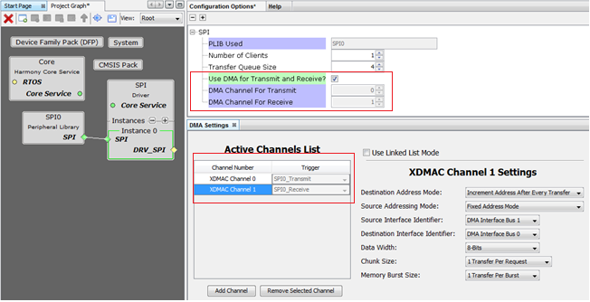

# Configuring The Library

SPI Driver Library should be configured via MHC. The following figures show the MHC configuration window for SPI driver and brief description.

**Common User Configuration for all Instances**

-   **Driver Mode:**

    -   Allows User to select the mode of driver\(Asynchronous or Synchronous\). This setting is common for all the instances.

**Instance Specific User Configurations**

**SPI Driver Configuration in Asynchronous Mode**

-   **PLIB Used:**

    -   Indicates the underlying SPI PLIB used by the driver.

    -   The SPI driver only supports connecting to the SPI PLIB in master mode.

-   **Number Of Clients:**

    -   The total number of clients that can open the given SPI driver instance

-   **Transfer Queue Size:**

    -   Indicates the size of the transfer queue for the given SPI driver instance

    -   Available only in Asynchronous mode of Operations

-   **Use DMA for Transmit and Receive?**

    -   Enables DMA For transmitting and receiving the data for that instance

    -   **DMA Channel For Transmit:**

        -   DMA Channel for transmission is automatically allocated in DMA configurations

    -   **DMA Channel For Receive:**

        -   DMA Channel for Receiving is automatically allocated in DMA configurations

**Parent topic:**[SPI Driver](GUID-B2925496-394D-47ED-BD1E-1AB2149934FA.md)

