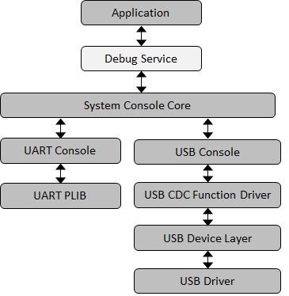

# How the Library Works

The Debug System Service provides APIs for the application developer to send formatted or unformatted messages to a system console.

**Abstraction Model**

The console core layer\_provides a POSIX-like read/write API to applications and middleware libraries to send and receive data to and from the console device.

Data and message buffering, along with the details of the data transfer are contained within the console device and peripheral library \(PLIB\) layers

**Working Flow**

**Debug Messages and Error Reporting**

The following macros are available to output debug and error messages. The default implementation of these macros resolves to nothing by the preprocessor. This is to allow the developer to leave debug messaging in the released code without impacting code size or performance. Typically, the developer would define SYS\_DEBUG\_USE\_CONSOLE macro through MHC configuration for debug builds, to map these macros to appropriate debug service implementation.

-   SYS\_DEBUG\_MESSAGE\(level, message\) prints a debug message to the console device if the global error level is equal to or lower than that specified by the "level" argument

-   SYS\_DEBUG\_PRINT\(level, fmt, ...\) prints formatted messages to the console if the global error level is equal to or lower than that specified by the "level" argument. The message formatting is the same as printf

**Changing the System Error Level**

Two functions are provided to manipulate the global system error level at runtime. This may be useful when you want to increase the debug verbosity for a particular section of code, but not for the entire program

-   SYS\_DEBUG\_ErrorLevelGet\(\) returns the current global system error level

-   SYS\_DEBUG\_ErrorLevelSet\(level\) sets the current global system error level

**Parent topic:**[Debug System Service](GUID-4F625306-2206-49B1-8846-60C97E40A440.md)

