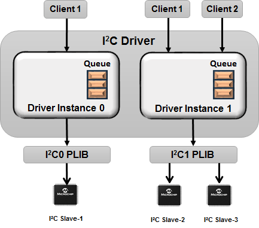

# How the Library Works

The I2C driver library is a multi-client, multi-instance buffer queue model based driver interface.

**Abstraction Model**

The following diagram illustrates the model used by the I2C Driver.

-   **Note:** Queue is not present in Synchronous mode of the driver.

**Working Flow**

-   The I2C driver is built on top of the I2C peripheral library

-   The I2C driver is capable of supporting multiple instances of the I2C peripheral

-   The I2C driver supports multiple clients to a driver instance. This is used when there are more than one I2C slaves on the same bus. The driver changes the I2C clock speed automatically based on the I2C slave being talked to you \(that is, based on which client submitted the request\).

I2C driver is capable of working in both Asynchronous and Synchronous modes.

**I2C driver in Asynchronous mode**

Asynchronous mode APIs are non-blocking in nature. These APIs submit a request and return back to the application.

Typically, if there are no on-going or pending requests in the driver's transfer queue, then the transfer is started by the API and completed from the peripheral interrupt. If there is an on-going transfer or one or more requests pending in the driver's transfer queue, then the request is added to the queue and executed when all the pending requests are complete. The size of the transfer queue is configurable using MCC based on application needs.

The transfer APIs provide a transfer handle back to the application. If the driver was unable to accept the request, then the transfer handle will be set to NULL. This usually happens if the transfer queue is full or if invalid argruments are passed to the API. Application must check the value of the transfer handle to ensure the request was accepted successfully. Transfer handle can be used to identify/track the request.

Application can either register a callback to get notified when the transfer is complete or poll the status of the request by calling the DRV\_I2C\_TransferStatusGet\(\) API. Asynchronous mode APIs are available in both bare-metal and RTOS mode.

**I2C driver in Synchronous mode**

Synchronous mode APIs are blocking in nature. These APIs block until the transfer/request is complete. Synchronous mode APIs are only supported in RTOS mode. These APIs initate the transfer and then block on a semaphore while the transfer is in progress, thereby allowing other ready tasks to run. Once the transfer is complete, the semaphore is given \(from the peripheral interrupt's context\) thereby unblocking the calling task. The return value usually provides the status of the transfer.

**Slave Address Format**

The slave address format used to submit the transfer request is shown below

**Parent topic:**[I2C Driver](GUID-4321CAFA-57B5-4633-9D43-0AE24B87C101.md)

