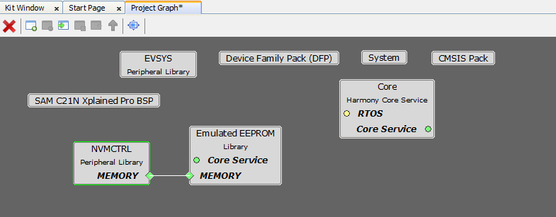
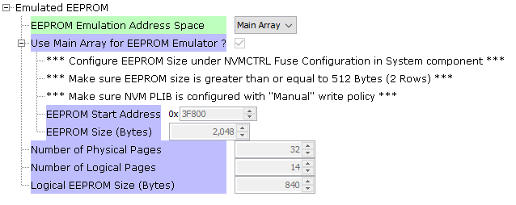
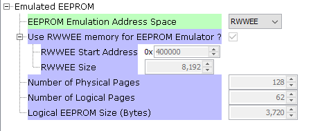
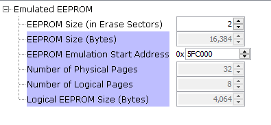

# Configuring The Library

Emulated EEPROM Library should be configured via MHC. The following figures show the MHC configuration window for Emulated EEPROM and brief description.

**Emulated EEPROM in Project Gaph**

**Emulated EEPROM library with Main Array region used for EEPROM Emulation address space on Cortex M0+ devices**

-   The EEPROM size is configured through fuse settings in MHC on M0+ devices.

**Emulated EEPROM library with RWWEE region used for EEPROM Emulation address space on Cortex M0+ devices**

-   The RWWEE size is fixed and it uses the full RWWEE space available on that device.

**Emulated EEPROM library with Main Array region used for EEPROM Emulation address space on Cortex M4/M7 devices**

**Configuration Options**

-   **EEPROM Emulation Address Space**

    -   Indicates the memory space used for EEPROM Emulation

-   **EEPROM Size \(in Erase Sectors\)**

    -   Size of EEPROM Emulation region specified by user in terms of Erase sectors.

    -   For example, on SAM E70, the erase sector size is 8192 bytes. Hence, EEPROM Emulation region must be atleast 16384 bytes or more.

    -   This is because, one sector will be reserved as spare and the data from full row will be copied to the spare row when a write request is made to the full row.

-   **EEPROM Start Address / EEPROM Emulation Start Address**

    -   Indicates the start address of the EEPROM Emulation region

    -   If main array is used, then the EEPROM Emulation region is allocated from the end of the main array.

        -   For example, if the total size of main array is 256 KB \(0x40000\), and the EEPROM Emulation size is 2048 bytes, then the 2048 bytes will be allocated from the end of the main array and the EEPROM Emulation region will start from 256KB - 2KB = 254KB \(0x3F800\).

    -   If RWWEE region is used, the EEPROM Emulation region is allocated from the start of the RWWEE region and the entire RWWEE region is used as EEPROM Emulation region.

-   **Number of Physical Pages**

    -   Indicates total number of physical pages in the EEPROM Emulation region.

    -   For example, on M0+ devices a page is of 64 bytes. Hence, if EEPROM Emulation region size is 2048 bytes, total number of physical pages will be 2048/64 = 32

-   **Number of Logical Pages**

    -   Indicates total number of logical pages in the EEPROM Emulation region

    -   For example, on M0+ devices, a row consists of 4 pages. On such devices each row only stores data for 2 logical pages. Hence the total number of logical pages is halved.

    -   In addition, one row \(4 pages\) are reserved for spare row. Hence, if the total number of physical pages in EEPROM Emulation region is 32 \(i.e. 8 rows\), the number of local pages will be:

        -   Total Rows - Spare Row = 8 - 1 = 7 rows.

    -   Each row can store 2 logical pages. Hence total logical pages = 7 \* 2 = 14 logical pages.

-   **Logical EEPROM Size \(Bytes\)**

    -   Indicates total logical space available in terms of bytes

    -   Each page reserves 4 bytes for storing internal data which is used by the EEPROM Emulation library

    -   Hence, if the total number of logical pages is 14 and if the page size is 64 bytes, then total logical EEPROM size in bytes will be 14 x \(64-4\) = 14 x 60 = 840 bytes.

**Note:**

In each case, the total size of EEPROM Emulation region must be greater than or equal to two Erase Sectors.

-   For example, on SAM C21, the erase size is one row. Size of one row is 256 bytes. Hence EEPROM Emulation region must be 512 bytes or more.

-   Similarly on SAM E70, the erase size is 8192 bytes. Hence, EEPROM Emulation region must be atleast 16384 bytes or more.

**Parent topic:**[Emulated EEPROM](GUID-7D1381D7-9A05-495B-B0A8-D195FA444618.md)

