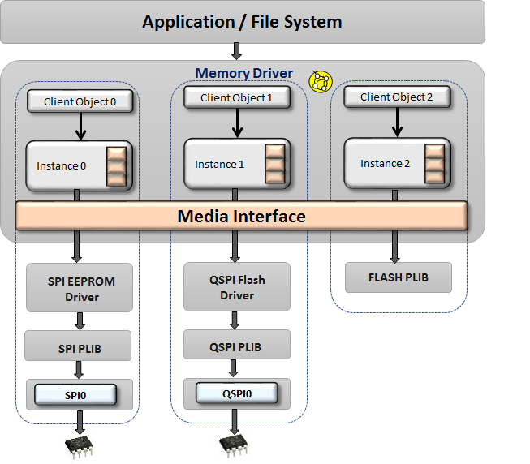

# How the Library Works

The memory driver library is a multi-client, multi-instance buffer queue model based block driver interface.

**Abstraction Model**

The Memory driver provides abstraction to communicate with different media devices via a common Media Interface **\(DRV\_MEMORY\_DEVICE\_INTERFACE\)**.

-   **Note:** Queue is not present in Synchronous mode of the driver.




**Memory Driver Common Features:**

-   Each instance of the driver has its own buffer queue which allows the capability to not block other media operations

-   Each instance of the driver can either have File-system as client or an application as client

-   Every transfer request expects data in blocks. Block details \(Size and number of blocks\) can be retrieved by **DRV\_MEMORY\_GeometryGet\(\)**

-   Driver provides feature to register call back for transfer complete event, which can used by clients to get notified

-   When the Memory driver is connected to the File System, the buffer queue is disabled as it is a blocking interface


**Overview on behavior of memory driver in below two modes:**

|Asynchronous Mode|Synchronous Mode|
|-----------------|----------------|
|Works in both Bare-Metal and RTOS environment|Works only in RTOS Environment|
|Provides Non-Blocking behavior|Provides Blocking behavior. Application thread gets blocked on a semaphore until transfer request is completed.|
|API's to be used **DRV\_MEMORY\_AsyncXxx\(\)**|API's to be used **DRV\_MEMORY\_SyncXxx\(\)**|
|API's return with a valid handle which can be used to check whether transfer request is accepted|API's return true or false to indicate whether the whole transfer is completed.|
|**For Bare-Metal** a dedicated task routine DRV\_MEMORY\_Tasks\(\) is called from SYS\_Tasks\(\) to process the data from the instance queue. **For RTOS** a blocking dedicated thread is created for task routine DRV\_MEMORY\_Tasks\(\) to process the data from the instance queue.|As the Driver works in complete blocking behavior there is no task routine generated.|
|A Client specific handler will be called to indicate the status of transfer.|A Client specific handler will be called to indicate the status of transfer before returning from API. Although the return type of API also can be used to identify the status of transfer.|

**How to plugin Media's to Memory Driver**

The **DRV\_MEMORY\_INIT** data structure allows a Media driver Or Media peripheral library to be plugged into the Memory block driver.

Any media that needs to be plugged into the Memory block driver needs to implement the interface \(function pointer signatures\) specified by the **DRV\_MEMORY\_DEVICE\_INTERFACE** type.

```c
// This code snippet shows an example of initializing the Memory Driver
// with SST26 serial flash device attached and File system Enabled.

SYS_MODULE_OBJ objectHandle;

static uint8_t gDrvMemory0EraseBuffer[DRV_SST26_ERASE_BUFFER_SIZE] CACHE_ALIGN;

static DRV_MEMORY_CLIENT_OBJECT gDrvMemory0ClientObject[DRV_MEMORY_CLIENTS_NUMBER_IDX0] = { 0 };

static DRV_MEMORY_BUFFER_OBJECT gDrvMemory0BufferObject[DRV_MEMORY_BUFFER_QUEUE_SIZE_IDX0] = { 0 };

const DRV_MEMORY_DEVICE_INTERFACE drvMemory0DeviceAPI = {
    .Open = DRV_SST26_Open,
    .Close = DRV_SST26_Close,
    .Status = DRV_SST26_Status,
    .SectorErase = DRV_SST26_SectorErase,
    .Read = DRV_SST26_Read,
    .PageWrite = DRV_SST26_PageWrite,
    .EventHandlerSet = NULL,
    .GeometryGet = (DRV_MEMORY_DEVICE_GEOMETRY_GET)DRV_SST26_GeometryGet,
    .TransferStatusGet = (DRV_MEMORY_DEVICE_TRANSFER_STATUS_GET)DRV_SST26_TransferStatusGet
};

const DRV_MEMORY_INIT drvMemory0InitData =
{
    .memDevIndex = DRV_SST26_INDEX,
    .memoryDevice = &drvMemory0DeviceAPI,
    .isFsEnabled = true,
    .deviceMediaType = (uint8_t)SYS_FS_MEDIA_TYPE_SPIFLASH,
    .ewBuffer = &gDrvMemory0EraseBuffer[0],
    .clientObjPool = (uintptr_t)&gDrvMemory0ClientObject[0],
    .bufferObj = (uintptr_t)&gDrvMemory0BufferObject[0],
    .queueSize = DRV_MEMORY_BUFFER_QUEUE_SIZE_IDX0,
    .nClientsMax = DRV_MEMORY_CLIENTS_NUMBER_IDX0
};

//usage of DRV_MEMORY_INDEX_0 indicates usage of Flash-related APIs
objectHandle = DRV_MEMORY_Initialize((SYS_MODULE_INDEX)DRV_MEMORY_INDEX_0, (SYS_MODULE_INIT *)&drvMemory0InitData);

if (SYS_MODULE_OBJ_INVALID == objectHandle)
{
    // Handle error
}
```

**Parent topic:**[Memory Driver](GUID-0FFCD458-7F10-49C8-B068-E4E4B5439C47.md)

